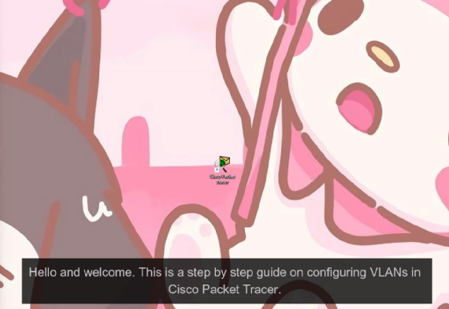

[Home](index.md) | [Deliverables](deliverables.md) | [Manual Assessment Memo](manual_assessment_memo.md) | [Chatbot](chatbot.md) | [Procedure Video](procedure_video.md) | [Manual](manual.md) | [Reflective Blogs](reflective_blogs.md)

# Procedure Video
## Reason for the Assignment
People often need help with a specific procedure that is especially complicated or difficult to explain in static text and images. Enter: video. 
The procedure video explains how to do one specific thing and is short and to the point. It does not need to include the "why" of each step (like a tutorial does). This is simply how to do one thing.

**Chat-gpt 4o was utilized in the creation of the script for this assignment**
**Wondershare DemoCreator was used as the video editing software for this assignment**

## Configuring VLANs on a Cisco Switch – Step-by-Step Guide in Packet Tracer

### Linked Image

Configuring VLANs on a Cisco Switch – Step-by-Step Guide in Packet Tracer Video by Alyson Lalata

### Direct Link
[Link to Alyson Lalata's Procedure Video Configuring VLANs on a Cisco Switch](https://youtu.be/FxOtBBkZVms)

---

In this video, I walk through the process of configuring VLANs on a Cisco switch using Packet Tracer. This tutorial covers setting up a basic network topology, creating VLANs, assigning ports, configuring IP addresses, and verifying network connectivity.

- Setting up a network topology with a Cisco 3560 switch and multiple PCs
- Creating VLANs for different departments (Sales and HR)
- Assigning switch ports to VLANs to segment traffic
- Configuring static IP addresses for each PC within their VLAN subnets
- Verifying VLAN configuration using CLI commands
- Testing network connectivity with the ping command

By the end of this video, you’ll understand how to properly configure VLANs in Packet Tracer, ensuring improved network segmentation and security. 

