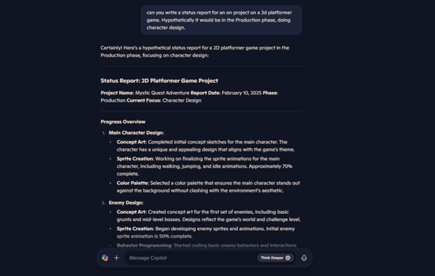
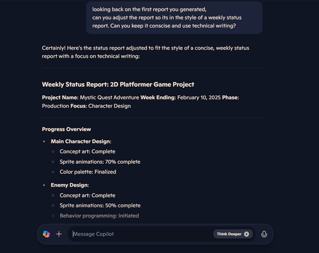
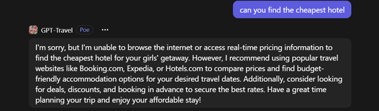
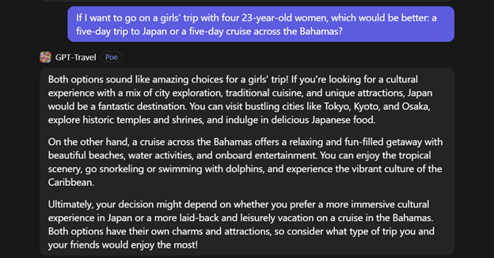
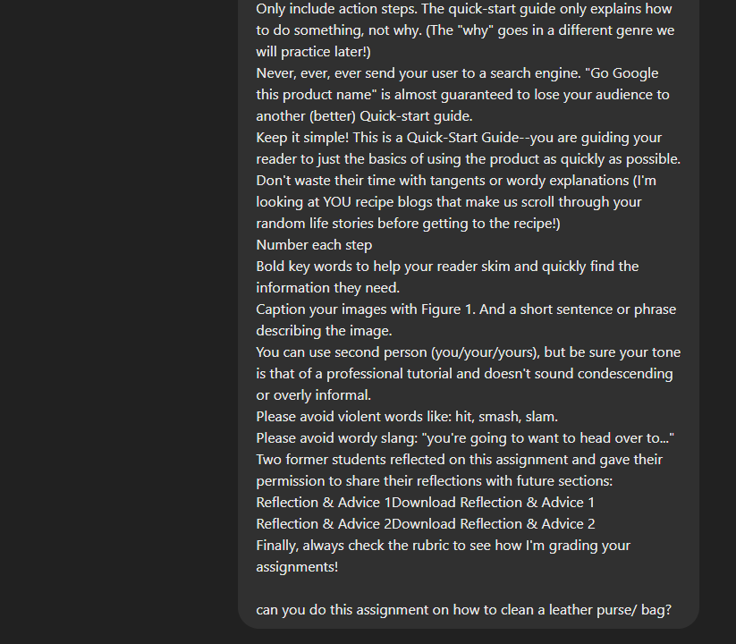
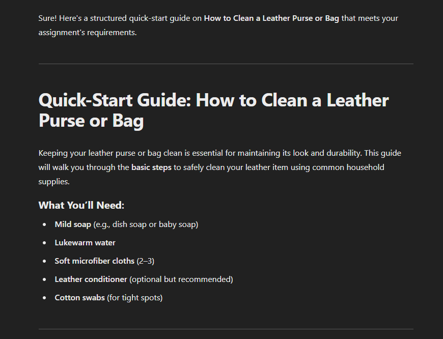

[Home](index.md) | [Deliverables](deliverables.md) | [Manual Assessment Memo](manual_assessment_memo.md) | [Chatbot](chatbot.md) | [Procedure Video](procedure_video.md) | [Manual](manual.md) | [Reflective Blogs](reflective_blogs.md)

## This page features Reflective Blogs that showcase Alyson Lalata's understanding of the course texts and her exploration of new genres.
ChatGPT GPT-4 was utilized in the creation of this page, serving as a tool for spellchecking and ensuring clarity and consistency.
# Table of Contents 
1. [Wayback Analysis](#wayback-analysis)
2. [Quick Start Guide](#quick-start-guide)
3. [Reflective Blog 3](#reflective-blog-3)
4. [Reflective Blog 4](#reflective-blog-4)
5. [Reflective Blog 5](#reflective-blog-5)
6. [Reflective Blog 6](#reflective-blog-6)
7. [Reflective Blog 7](#reflective-blog-7)
   
# Wayback Analysis

## Assignment Rationale 
This assignment asks you to explore websites that don't follow contemporary standards in order to think critically about what standards you as a visitor have come to expect and to contemplate why these designs have become so standard across so many different types of sites.

---
### Target in 1998 vs. 2025

Figure 1.1 - Screenshot by Alyson Lalata. "Target Home Page on January 12, 1998." Https://Web.Archive.Org/Web/19980112113113/Http://Www.Target.Com/. Accessed 21 Jan. 25.

Figure 1.2 - Screenshot by Alyson Lalata. "Target Home Page on January 21, 2025." https://www.target.com/. Accessed 21 Jan. 25. 

---

Using the Wayback Machine, I analyzed the Target website from January 12, 1998, and compared it to the website as of January 21, 2025. Over this 27-year span, the differences in website composition, layout, and functionality were striking, shedding light on how website norms have evolved and how these changes shape the user experience.

### Surprising and Out-of-the-Ordinary Elements
The 1998 Target website featured minimalism and unexpected links to pages of text. The homepage displayed a box divided into smaller sections, advertising the Washington Monument Restoration donation, the Lullaby Club (a baby gift registry), and school uniforms (see fig. 1.1). The promotion for school uniforms to prevent children from being "approached by gangs" stood out as unconventional and out of pleace compared to modern product-focused websites, where companies often avoid publicizing beliefs that might deter potential customers.

Another surprising aspect was the lack of seasonal or promotional content. Despite the proximity to Valentine’s Day, the 1998 site did not feature any related promotions or imagery. This absence of such timely, engaging content felt like a missed opportunity when compared to the modern Target site, which prominently features holiday themes and tailored shopping sections.

### Expected Website Norms and Modern Standards
Modern websites prioritize visual appeal, interactivity, and intuitive navigation. The 2025 Target website utilizes these standards with vibrant visuals, drop-down menus, and calls to action such as “Find cute Valentine’s Day looks everyone will love” (see fig. 1.2) or “All the top deals in one place.” Features like trending items, discounts, and Lunar New Year categories showcase a focus on personalization and engagement.

These features stand in stark contrast to the 1998 Target site, which lacked intuitive navigation tools and relied on text-heavy descriptions with minimal visual appeal. Its static design and limited functionality made it feel more like a basic tool than an engaging digital store. The bottom menu provided few paths to other sections and lacked the flexibility of modern navigation systems.

### The Experience of Visiting an Old Version of the Target Website

Figure 1.3 - "Target Uniform Page on January 12, 1998." https://web.archive.org/web/19980112113217/http://www.target.com/TargetWWW/schooluniforms/index.html/. Accessed 21 Jan. 25.

As a modern internet user, I had difficulty using visiting the 1998 Target website. As seen in figure 1.3, the lack of any drop-down menus or a cohesive navigation system made it unpleasant to explore, requiring me to rely on the browser’s back button to move between pages. This clunky navigation sharply contrasts with the effortless experience of scrolling and clicking through the 2025 site.

The outdated design also felt visually uninviting. The outdated design was visually bland, with limited use of color, imagery, and fonts. While the modern Target site is designed to encourage prolonged browsing and impulse purchases, the 1998 site seemed solely focused on selling items people were specifically looking for and not trying to rope them into buying more.

### Broader Reflections on Web Design Evolution
The evolution of the Target website mirrors broader trends in web design and technology. I feel that back then, any type of website would have sufficed because there was not such rigor competition for consumers’ attention. Today, faster connections, mobile accessibility, and the rise of online shopping have made rich visuals, interactivity, and personalization the standard.

This assignment highlighted just how much our expectations for websites have changed. Elements like drop-down menus, personalized recommendations, and seasonal promotions is so common that their absence feels unnatural. Visiting the 1998 Target site was a stark reminder of how far web design has come and how integral modern norms are to creating an engaging user experience.

---
---
# Quick Start Guide

## Assignment Rationale 
Changes in technology can cause disruptive changes across many industries! On the job in the computer industry, it is likely that you will be asked to complete quick-start guides, tutorials, instructional videos, and manuals in a very short amount of time. Other careers may also require these skills, and given how many of us rely on computers in our daily lives, the updates that are constantly being pushed out, unfortunately, sometimes seem to take the approach of "update now, explain the update to users later" (anybody remember Windows 8Links to an external site.?).

You need to be able to quickly figure out a platform on your own, and then clearly explain how to use it in writing, image, or video (or a combination of these).

---

  

Figure 1.1 - "Windows 11 Logo." https://news.microsoft.com/. Accessed 28 Jan. 25. 

## Setting Up a Windows 11 Laptop Without Logging into a Microsoft Account
When setting up a new Windows 11 laptop, Microsoft will prompt users to create a Microsoft account, or log into an existing account. But if someone wants to bypass this process for any reason, this guide will provide step-by-step instructions on how to set up a Windows 11 device without logging into a Microsoft account.

### Step 1: Open the box

   Place the laptop box on a flat surface and proceed to follow the steps to open the box
   - Cut any seals or tap: Carefully use scissors or a box cutter to remove the seals on the box.
   - Remove the lid: Lift the lid off of the box to reveal the laptop and accessories inside.
   - Remove the contents: Take out the laptop, charger, and any other accessories or documents from within the box.

### Step 2: Remove the Laptop from the Packaging

   Once the box is opened and the contents are removed, it is time to remove the plastics surrounding the device and accessories. 
   - Unwrap the laptop: Use the pull tabs to remove the laptop from any plastic sleeve or covers.
   - Unwrap the accessories: Remove any plastic or protective covers from the charger and uncoil the cable.
   - Prepare the charger: Once the charger is uncoiled, plug it into a wall outlet and the other end into the computer.

### Step 3: Power on the Laptop

   Now that the computer is charging and all protective plastic has been removed, power on the laptop
   - Locate the power button: Inspect the device for its power button, it can typically be found on the side of the device or on or above the keyboard
   - Press the power button: Press the power button once for 2 seconds to turn on the laptop.
   - Wait for the “Welcome” screen: Allow the laptop to boot up and display the Windows setup screen.

### Step 4: Open Command Prompt

   With the computer now and displaying the “Welcome” screen, open the command prompt.
   - Activate Command Prompt: While still on the “Welcome” screen, press “Shift” +” F10” on the keyboard. This will open the black Command Prompt window
      - If the keyboard does not have the function keys, press “Shift” +” Fn” +”F10” on the keyboard.

### Step 5: Execute the Bypass Command

   Once the command prompt is open, enter the command to bypass the Wi-Fi connection and the Microsoft account. 

  

Figure 1.2 - Screenshot by Alyson Lalata. "Windows Command Prompt." Accessed 28 Jan. 25. 

   - Type in the command: Click anywhere in the command prompt window and type in **oobe\bypassnro** and press enter.
   - Allow the Laptop to reset: Entering this command will automatically reset the device.

### Step 6: Complete the Setup Process
   Now that the device is reset, there will no longer be the Wi-Fi connection and the Microsoft account. 

  

Figure 1.3 - Yee, Alaina, and PCWorld Senior Editor. “Setting up a Local Account in Windows 11 Is Tricky. Here’s How to Do It.” PCWorld, 19 May 2023, www.pcworld.com/article/1921608/how-to-set-up-a-local-account-in-windows-11.html. 

   - Answer the initial setup questions: The computer will prompt you to select your language, region and keyboard layout. Answer to your preferred selection.
   - Choose “Choose with Limited setup”: In the bottom right of the Wii-Fi selection screen, select the “Choose with Limited setup” option.
   - Name the device: Enter the desired name of the device
      - Optional: Create a password to protect the device

### Step 7: Finalize the setup

   With the first half of the setup complete, its now to finish up the setup process. 

  

Figure 1.4 - Blasac, Nathan. “Testing Autopilot on Windows 11 with SCCM Client Install.” Medium, Nathan Blasac - Notes from the Field, 9 July 2021, nathanblasac.com/testing-autopilot-on-windows-11-with-sccm-client-install-e89dfeaebd04. 

   - Answer the remaining prompts: Configure the settings to your preferences, or agree to default settings by pressing the “Enter” key.
   - Wait for the final configurations: A screen saying “Making sure everything is ready to go. Don’t turn off your PC” will appear. Do not turn the device off and keep the device plugged and wait to finalize the setup.

### Step 8: Start using the device
   Now that the setup is complete, the laptops desktop to appear. And with that the device has been set up without the need to connect to Wi-Fi or log into a Microsoft account. 

---
# Reflective Blog 3
## Assignment Rationale: Prompt C
Ask a generative AI tool (maybe one in Boodlebox or Copilot) to generate something you might have to write in your future career. Assess the result, and then revise your prompt or "stack" an additional prompt onto it (e.g., "remove the passive voice and add headings"). Congratulations, you're a prompt engineer now. Add this skill to your resume. On your website, post: 1) your original and revised prompts 2) your assessment of what it generated 3) (optional) what it generated.

**ChatGPT GPT-4 was utilized in the creation of this assignment, serving as a tool for spellchecking and ensuring clarity and consistency.**
**Microsoft Copilot was used as the generative AI tool in this assignment**

---
## Orginal Prompt
“can you write a status report for an on project on a 2d platformer game. Hypothetically it would be in the Production phase, doing character design.”

## Revised Prompt:
"looking back on the first report you generated, can you adjust the report so it’s in the style of a weekly status report. Can you keep it concise and use technical writing?”

---
## Assesment and reflection on what was generated 
I was pleasantly surprised on what Microsoft Copilot was able to generate. First I researched what the proper components of a Status report is, and then crafted the prompt that I wanted the AI to use. I am already familiar with the phases and processes of creating a 2D platformer game, so I thought it was best that I used this as the subject of the report. 

  

Figure 1.1 - Screenshot by Alyson Lalata. "Copilot's First Generated Status Report" https://copilot.microsoft.com/. Accessed 10 Feb. 25.

The first report was highly detailed but felt overly wordy. It seemed to be written for an audience with little to no prior knowledge of the project, I didn’t specify on the type of status report (daily, weekly, monthly, internal or external) so I understood as to why the report had so much information. It effectively covered key aspects of game production, highlighting both challenges and achievements. The Progress Overview section provided an in-depth breakdown of different character design aspects. The achievements and challenges were clearly outlined, along with specific actions needed to move the project forward. 

  

Figure 1.2 - Screenshot by Alyson Lalata. "Copilot's Second Generated Status Report" https://copilot.microsoft.com/. Accessed 10 Feb. 25.

In contrast, the second report was much more concise. It didn’t elaborate on every detail encountered, making it more effective for quickly informing the team about that week’s progress without being overly long or difficult to read. This version appeared to be tailored for an internal audience already familiar with the project, unlike the original report. The Progress Overview was able to summarize each aspect of character design, briefly mentioned key accomplishments for the week, and included a short description of the main issues faced.

Despite these differences, both reports maintained the same structure and headings, consistently providing status updates on each stage of the process (e.g., “Completed,” “70% complete”). 

One limitation I noticed was the AI’s tendency to generalize. While the structure of the reports was consistent, I found that I would need to specify areas of the prompt to align with the actual progress of the project. If I were to generate another status report, I would write my prompt so that it specifies which details to emphasize and how much explanation is needed. But with all said, I still think it would be better to write out the status report oneself and then have an AI tool compress it so that it is more concise and will know all the information that you want in the report than taking its own liberties.

Through this exercise, I gained insight into both the capabilities and limitations of AI in technical writing. While Microsoft Copilot can generate structured and informative reports, the human touch remains crucial in refining the content for fact-checking, tone, and readability. 

---
# Reflective Blog 4
## Assignment Rationale 

Prompt F: Reflect on one of your completed Deliverables for this course. What was easy for you? What was more difficult? Why? What did completing this assignment teach you about yourself and technical communication? What would you do differently based on the instructor's feedback? Note: this one is vintage only, but you can use AI tools for editing.

**Grammarly and Microsoft Word’s text correction tools were used for grammar and style checks.**

---
The Manual Assessment Memo was a challenging but insightful assignment. I chose a printer manual because of its common usability frustrations. While the manual avoided redundancy, I found that it lacked clarity in some areas, making troubleshooting difficult. 

One of my main challenges was ensuring my critique was constructive rather than nitpicking. I initially wrote too much, reducing the readability and conciseness expected in a memo. To refine my response, I used ChatGPT-4 to identify redundant sections while ensuring my critique remained focused.

This assignment reminded me that technical writing must be concise, and not everything needs a detailed explanation. Based on Dr. Johnson’s feedback, I would ensure that links are clickable and eliminate unnecessary descriptors that slow the reader down. In future assignments, I will be more intentional about keeping my writing skimmable and concise while maintaining precision.

**Grammarly and Microsoft Word’s text correction tools were used for grammar and style checks.**
---

# Reflective Blog 5
## Assignment Rationale 
Prompt E: Analyze a chatbot (e.g., customer service, virtual assistant). Spend at least 5 minutes interacting with it & exploring its functionality. Then, reflect on the bot's: purpose (What is the chatbot designed to do?, functionality (how well does it perform its tasks?), user experience (was it easy to use? What were the strengths and weaknesses?), and context (how does it benefit users and the organization?)

**ChatGPT GPT-4 was utilized in the creation of this assignment, serving as a tool for spellchecking and ensuring clarity and consistency.**
**GPT-Travel Poe was Chatbot tool in this assignment**

---

GPT-Travel is a chatbot designed to assist tourists by suggesting destinations, activities, and general travel advice. However, my first experience with it was frustrating due to its limitations. I was expecting the cite to help me find hotels, events happening around the location I was planning to travel and more. Unfortunately the chatbot was unable to browse the internet, and instead directed me to other websites that could possiblely help.

  

Figure 1.1 - Screenshot by Alyson Lalata. "GPT-Travel Tries to Find Cheapest Hotel" https://poe.com/GPT-Travel. Accessed 3 Mar.

GPT-Travel is useful for generating broad travel ideas and providing general estimates, but it lacks real-time information gathering, contextual memory, and precise budgeting tools. The cite itself is pleasant to look at, similar to many other AI tools with a dark background with white text. The chatbot is easy to use and responds quickly, but its inability to retain context and reliance on pre-existing knowledge limit its effectiveness. While structured queries improve its responses, users must be very specific to get relevant answers. 

  

Figure 1.2 - Screenshot by Alyson Lalata. "GPT-Travel Compares Vacation" https://poe.com/GPT-Travel. Accessed 3 Mar.

GPT-Travel is best suited as an initial trip-planning tool rather than a full-fledged travel assistant. The chatbot gives users general ideas, common tourist spots/ activities while using descriptive diction to paint each location in a positive light. It can help users brainstorm destinations and activities, but it can not replace real-time travel research. The chatbot was also able to successfully compare two different types of travel vacations when given details about the party going (Figure 1.2). Additionally, retaining memory from pervious inquiries would provide a smoother chatting experience so users do not have to repeat themselves. The chatbot however worked better when being very specific in the inquires entered, but it took away from the ease of use of the experience, making it less intuitive.

While GPT-Travel can offer general travel suggestions and comparisons, its lack of real-time data and contextual awareness limit its practicality. It is best used for brainstorming rather than detailed trip planning, and users must carefully structure their inquiries to get the most relevant results.

ChatGPT GPT-4 was utilized in the creation of this assignment, serving as a tool for spellchecking and ensuring clarity and consistency.
GPT-Travel Poe was Chatbot tool in this assignment
---
# Reflective Blog 6
## Assignment Rationale 
Prompt R: After you have completed the Chatbot assignment or any assignment using AI for most of the work, reflect on your interaction with this emerging technology: What does AI do well? What does it not do well? What did you have to correct or re-prompt it to modify? What can you know about its training data? What kinds of data was included? What kinds of data was excluded? What do you think the future holds as this technology is used and further advanced?

**ChatGPT GPT-4 was utilized in the creation of this assignment, serving as a tool for spellchecking and ensuring clarity and consistency.**
**GPT-Travel Poe was Chatbot tool analyzed in this assignment**

---
## Strengths of GPT-Travel
GPT-Travel performs well in generating general travel recommendations. It effectively suggests destinations, activities, and vacation comparisons based on user input. Additionally, the interface is user-friendly, and responses are generated quickly, enhancing accessibility.

## Limitations and Required Modifications
Despite its strengths, GPT-Travel has notable limitations. First being that there was a lack of real-time data. The chatbot cannot retrieve up-to-date information on hotel prices, events, or travel deals. Instead, it redirects users to external websites, reducing its effectiveness as a comprehensive planning tool. There was also limited context retention, where GPT-Travel did not maintain memory across interactions. As a result, I had to re-enter details when refining their queries, leading to inefficiencies in the interaction process. Finally there was a dependency on structured queries. The chatbot performed better when given specific and structured queries. This reduced the intuitiveness of the experience, as users must refine and rephrase their inputs multiple times to obtain relevant information.

## AI Training Data and Constraints
GPT-Travel’s responses suggest that its training data consists of static travel guides, pre-existing articles, and general travel knowledge rather than dynamic, real-time sources. The dataset likely includes information on popular tourist destinations and broad budgeting estimates but excludes real-time travel updates, localized events, and dynamic pricing. 

## Future Implications
Advancements in AI technology may enhance chatbot functionality with the integration of real-time data; where the AI can access live travel databases, providing current hotel rates, flight availability, and event schedules. Improved Context Awareness for enhanced memory capabilities could enable AI to retain previous interactions, reducing the need for repeated user input.
While GPT-Travel is a useful tool for initial trip planning, its limitations highlight the necessity of human input and supplementary research. As AI continues to evolve, it may transition from a brainstorming assistant to a fully functional travel planning system with real-time capabilities.

ChatGPT GPT-4 was utilized in the creation of this assignment, serving as a tool for spellchecking and ensuring clarity and consistency.
GPT-Travel Poe was Chatbot tool analyzed in this assignment

---
# Reflective Blog 7
## Assignment Rationale 
Prompt K: Use any generative AI to generate an assignment (or some other piece of writing) that you have already completed. Share the prompt you used, the results you received, and a brief analysis of the strengths and weaknesses of the software.

**ChatGPT GPT-4o was utilized in the creation of this assignment serving as the generative AI tool**

---

Figure 1.1 - Screenshot by Alyson Lalata. "Chat-GPT4o Prompt"

The assignment I had the AI generate was the Quick Start Guide; I fed the AI all the information given for the assignment from the Webcourses page, followed by "can you do this assignment on how to clean a leather purse/ bag?" giving the AI the topic that I wanted it to write about. (Figure 1.1) 

Chat-GPT was able to generate the whole assignment except for the pictures rather quickly. Its response was was follows:

---

Figure 1.1 - Screenshot by Alyson Lalata. "Chat-GPT4o Response"

Sure! Here's a structured quick-start guide on How to Clean a Leather Purse or Bag that meets your assignment's requirements.

# Quick-Start Guide: How to Clean a Leather Purse or Bag
Keeping your leather purse or bag clean is essential for maintaining its look and durability. This guide will walk you through the basic steps to safely clean your leather item using common household supplies.

## What You’ll Need:
Mild soap (e.g., dish soap or baby soap)

Lukewarm water

Soft microfiber cloths (2–3)

Leather conditioner (optional but recommended)

Cotton swabs (for tight spots)

## Step 1: Empty the Bag and Dust Off Debris
Before cleaning, remove all items from your bag, including any loose change or small objects hidden in pockets. Then, use a dry microfiber cloth to gently wipe away dust and dirt from the surface.

📷 Figure 1. Wiping off dust with a dry microfiber cloth.

## Step 2: Prepare a Mild Cleaning Solution
In a small bowl, mix a few drops of mild soap with lukewarm water. Dip a soft microfiber cloth into the solution, wring it out so it's damp but not soaking, and prepare to wipe down the bag.

📷 Figure 2. Mixing soap with lukewarm water.

## Step 3: Wipe the Leather Surface
Gently wipe the leather bag using the damp cloth in circular motions. Pay special attention to areas with stains or visible dirt. Avoid excessive water, as too much moisture can damage leather.

📷 Figure 3. Gently wiping the leather with a damp cloth.

## Step 4: Clean Crevices and Stitching
Use a cotton swab dipped in the cleaning solution to carefully clean hard-to-reach areas, such as stitching, seams, or decorative details.

## Step 5: Dry the Bag Immediately
After wiping down the bag, use a dry microfiber cloth to remove excess moisture. Let the bag air dry completely at room temperature, away from direct sunlight or heat sources.

## Step 6: Condition the Leather (Optional)
Once dry, apply a small amount of leather conditioner using a clean cloth. Buff it in gently to restore moisture and maintain the bag’s softness.

## Final Tips
✅ Do NOT use harsh chemicals like alcohol, acetone, or vinegar—these can damage leather.
✅ Test on a small area first before cleaning the entire bag.
✅ Store your bag properly in a dust bag when not in use.

This guide helps you clean your leather purse or bag quickly and safely. Follow these steps regularly to keep your bag looking as good as new!

Would you like any adjustments or additional details? 😊

---

Something that I got critiqued on was how I numbered my manual, the AI also numbered the heading which is not how it’s supposed to be. The guide uses items that are readily available in most households, making it accessible for a wide audience. But the captions provided were not that descriptive as to what should be in the picture and were not formatted properly. There were spots where I am to insert visuals to help enhance the guide and meet the assignment requirements. I found the diction and tone used to match the professional and instructional feel that the assignment calls for. There was consistency issues on the wordage used to describe certain items. For example, the term “mild soap” and “baby soap” are used interchangeably, but the guide should only refer to a product using the same term throughout to not confuse the reader. I think the guide could also use bullet points or bolding key terms within each step to make the guide even more skimmable. At the end of the guide there are helpful tips so that the user doesn’t damage their leather item.
