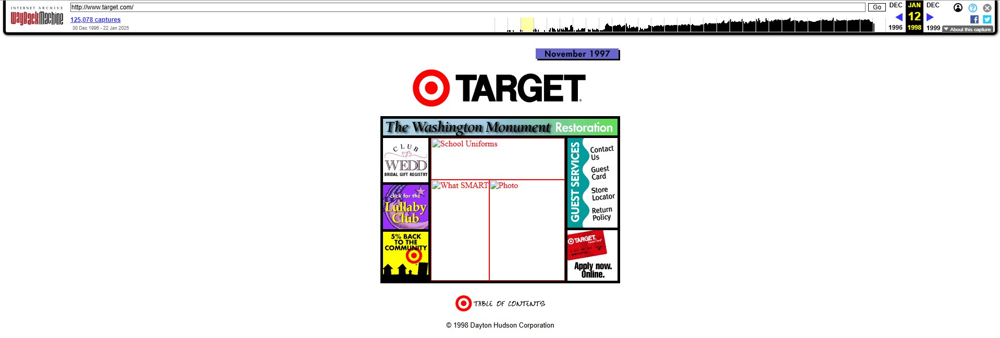
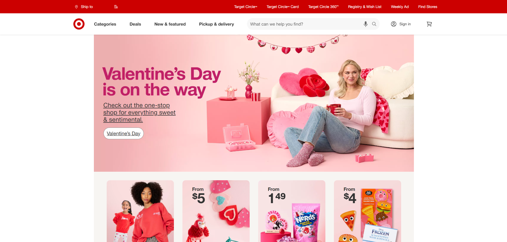
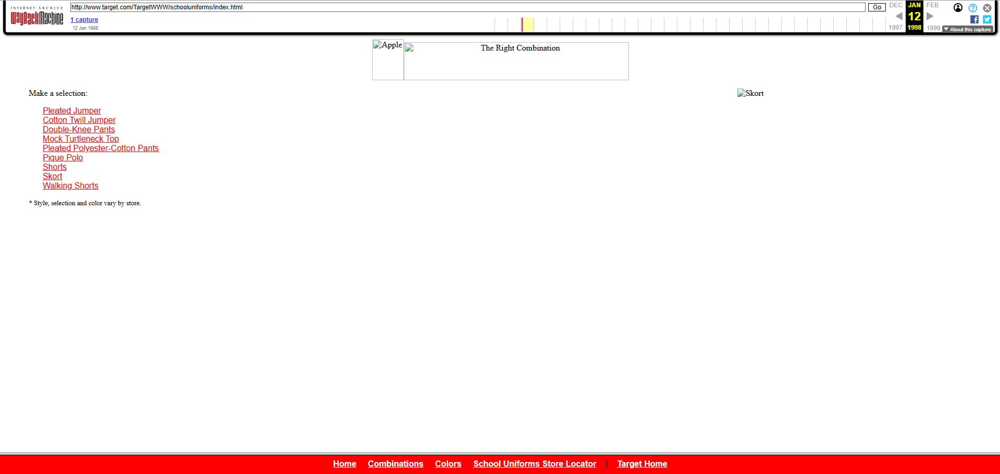
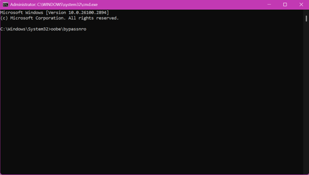
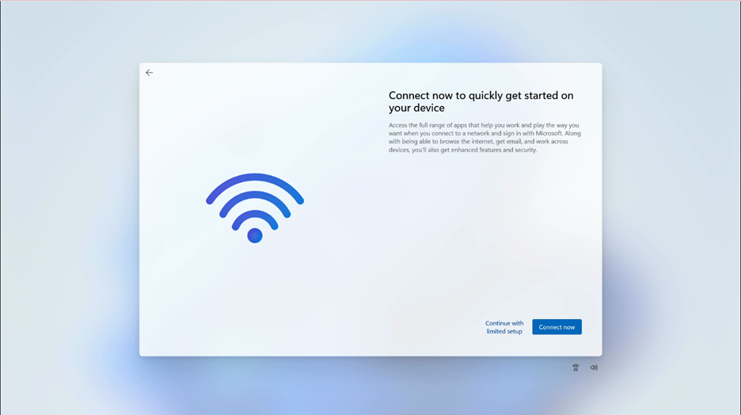
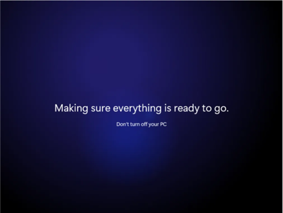

[Home](index.md) | [Deliverables](deliverables.md) | [Manual Assessment Memo](manual_assessment_memo.md) | [Chatbot](chatbot.md) | [Procedure Video](procedure_video.md) | [Manual](manual.md) | [Reflective Blogs](reflective_blogs.md)

## This page features Reflective Blogs that showcase Alyson Lalata's understanding of the course texts and her exploration of new genres.
ChatGPT GPT-4 was utilized in the creation of this page, serving as a tool for spellchecking and ensuring clarity and consistency.
# Table of Contents 
1. [Wayback Analysis](#wayback-analysis)
2. [Quick Start Guide](#quick-start-guide)
3. [Reflective Blog 3](#reflective-blog-3)
   
# Wayback Analysis

## Assignment Rationale 
This assignment asks you to explore websites that don't follow contemporary standards in order to think critically about what standards you as a visitor have come to expect and to contemplate why these designs have become so standard across so many different types of sites.

---
### Target in 1998 vs. 2025

Figure 1.1 - "Target Home Page on January 12, 1998." Https://Web.Archive.Org/Web/19980112113113/Http://Www.Target.Com/. Accessed 21 Jan. 25.

Figure 1.2 - "Target Home Page on January 21, 2025." https://www.target.com/. Accessed 21 Jan. 25. 

---

Using the Wayback Machine, I analyzed the Target website from January 12, 1998, and compared it to the website as of January 21, 2025. Over this 27-year span, the differences in website composition, layout, and functionality were striking, shedding light on how website norms have evolved and how these changes shape the user experience.

### Surprising and Out-of-the-Ordinary Elements
The 1998 Target website featured minimalism and unexpected links to pages of text. The homepage displayed a box divided into smaller sections, advertising the Washington Monument Restoration donation, the Lullaby Club (a baby gift registry), and school uniforms (see fig. 1.1). The promotion for school uniforms to prevent children from being "approached by gangs" stood out as unconventional and out of pleace compared to modern product-focused websites, where companies often avoid publicizing beliefs that might deter potential customers.

Another surprising aspect was the lack of seasonal or promotional content. Despite the proximity to Valentine’s Day, the 1998 site did not feature any related promotions or imagery. This absence of such timely, engaging content felt like a missed opportunity when compared to the modern Target site, which prominently features holiday themes and tailored shopping sections.

### Expected Website Norms and Modern Standards
Modern websites prioritize visual appeal, interactivity, and intuitive navigation. The 2025 Target website utilizes these standards with vibrant visuals, drop-down menus, and calls to action such as “Find cute Valentine’s Day looks everyone will love” (see fig. 1.2) or “All the top deals in one place.” Features like trending items, discounts, and Lunar New Year categories showcase a focus on personalization and engagement.

These features stand in stark contrast to the 1998 Target site, which lacked intuitive navigation tools and relied on text-heavy descriptions with minimal visual appeal. Its static design and limited functionality made it feel more like a basic tool than an engaging digital store. The bottom menu provided few paths to other sections and lacked the flexibility of modern navigation systems.

### The Experience of Visiting an Old Version of the Target Website

Figure 1.3 - "Target Uniform Page on January 12, 1998." https://web.archive.org/web/19980112113217/http://www.target.com/TargetWWW/schooluniforms/index.html/. Accessed 21 Jan. 25.

As a modern internet user, I had difficulty using visiting the 1998 Target website. As seen in figure 1.3, the lack of any drop-down menus or a cohesive navigation system made it unpleasant to explore, requiring me to rely on the browser’s back button to move between pages. This clunky navigation sharply contrasts with the effortless experience of scrolling and clicking through the 2025 site.

The outdated design also felt visually uninviting. The outdated design was visually bland, with limited use of color, imagery, and fonts. While the modern Target site is designed to encourage prolonged browsing and impulse purchases, the 1998 site seemed solely focused on selling items people were specifically looking for and not trying to rope them into buying more.

### Broader Reflections on Web Design Evolution
The evolution of the Target website mirrors broader trends in web design and technology. I feel that back then, any type of website would have sufficed because there was not such rigor competition for consumers’ attention. Today, faster connections, mobile accessibility, and the rise of online shopping have made rich visuals, interactivity, and personalization the standard.

This assignment highlighted just how much our expectations for websites have changed. Elements like drop-down menus, personalized recommendations, and seasonal promotions is so common that their absence feels unnatural. Visiting the 1998 Target site was a stark reminder of how far web design has come and how integral modern norms are to creating an engaging user experience.

---
---
# Quick Start Guide

## Assignment Rationale 
This assignment will let you experiment with a generative AI tool of your choice, and you will strengthen your critical thinking skills as you evaluate its strengths and weaknesses.

---

Figure 1.1 - "Windows 11 Logo." https://news.microsoft.com/. Accessed 28 Jan. 25. 

## Setting Up a Windows 11 Laptop Without Logging into a Microsoft Account
When setting up a new Windows 11 laptop, Microsoft will prompt users to create a Microsoft account, or log into an existing account. But if someone wants to bypass this process for any reason, this guide will provide step-by-step instructions on how to set up a Windows 11 device without logging into a Microsoft account.

### Step 1: Open the box

   Place the laptop box on a flat surface and proceed to follow the steps to open the box
   - Cut any seals or tap: Carefully use scissors or a box cutter to remove the seals on the box.
   - Remove the lid: Lift the lid off of the box to reveal the laptop and accessories inside.
   - Remove the contents: Take out the laptop, charger, and any other accessories or documents from within the box.

### Step 2: Remove the Laptop from the Packaging

   Once the box is opened and the contents are removed, it is time to remove the plastics surrounding the device and accessories. 
   - Unwrap the laptop: Use the pull tabs to remove the laptop from any plastic sleeve or covers.
   - Unwrap the accessories: Remove any plastic or protective covers from the charger and uncoil the cable.
   - Prepare the charger: Once the charger is uncoiled, plug it into a wall outlet and the other end into the computer.

### Step 3: Power on the Laptop

   Now that the computer is charging and all protective plastic has been removed, it is time to power on the laptop
   - Locate the power button: Inspect the device for its power button, it can typically be found on the side of the device or on or above the keyboard
   - Press the power button: Press the power button once for 2 seconds to turn on the laptop.
   - Wait for the “Welcome” screen: Allow the laptop to boot up and display the Windows setup screen.

### Step 4: Open Command Prompt

   With the computer now and displaying the “Welcome” screen, it is time to open the command prompt.
   - Activate Command Prompt: While still on the “Welcome” screen, press “Shift” +” F10” on the keyboard. This will open the black Command Prompt window
      - If the keyboard does not have the function keys, press “Shift” +” Fn” +”F10” on the keyboard.

### Step 5: Execute the Bypass Command

   Once the command prompt is open, enter the command to bypass the Wi-Fi connection and the Microsoft account. 

Figure 1.2 - "Windows Command Prompt." Accessed 28 Jan. 25. 

   - Type in the command: Click anywhere in the command prompt window and type in **oobe\bypassnro** and press enter.
   - Allow the Laptop to reset: Entering this command will automatically reset the device.

### Step 6: Complete the Setup Process
   With the device now reset, there will no longer be the Wi-Fi connection and the Microsoft account. 

Figure 1.2 - Yee, Alaina, and PCWorld Senior Editor. “Setting up a Local Account in Windows 11 Is Tricky. Here’s How to Do It.” PCWorld, 19 May 2023, www.pcworld.com/article/1921608/how-to-set-up-a-local-account-in-windows-11.html. 

   - Answer the initial setup questions: The computer will prompt you to select your language, region and keyboard layout. Answer to your preferred selection.
   - Choose “Choose with Limited setup”: In the bottom right of the Wii-Fi selection screen, select the “Choose with Limited setup” option.
   - Name the device: Enter the desired name of the device
      - Optional: Create a password to protect the device

### Step 7: Finalize the setup

Figure 1.3 - Blasac, Nathan. “Testing Autopilot on Windows 11 with SCCM Client Install.” Medium, Nathan Blasac - Notes from the Field, 9 July 2021, nathanblasac.com/testing-autopilot-on-windows-11-with-sccm-client-install-e89dfeaebd04. 

   With the first half of the setup complete, its now to finish up the setup process. 
   - Answer the remaining prompts: Configure the settings to your preferences, or agree to default settings by pressing the “Enter” key.
   - Wait for the final configurations: A screen saying “Making sure everything is ready to go. Don’t turn off your PC” will appear. Do not turn the device off and keep the device plugged and wait to finalize the setup.

### Step 8: Start using the device
   Now that the setup is complete, the laptops desktop to appear. And with that the device has been set up without the need to connect to Wi-Fi or log into a Microsoft account. 

---
# Reflective Blog 3
TBD
